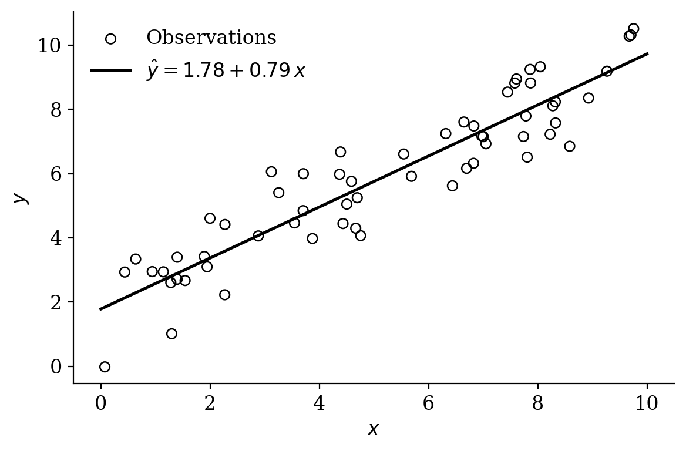

---
# IESP-UERJ dissertation/thesis template (ABNT) — English example.
# Write the document in English; a Portuguese "Resumo" is still required by ABNT.
# Render with:  quarto render main-en.qmd
format:
  iesp-uerj-pdf: default
lang: en  # localises cross-references (Figure, Equation, ...)

# ---- Document language: English labels (Contents, References, ...) ----
lang-en: true

# ---- Institution ----
university: "Universidade do Estado do Rio de Janeiro"
inst-center: "Centro de Ciências Sociais"
unit: "Instituto de Estudos Sociais e Políticos"

# ---- Authorship ----
author-first: "First name"
author-last: "Last name"
author-abbrev: "F."    # initial(s) of the first name, e.g. "F." or "F. L."

# ---- Title ----
title: "Title of the dissertation or thesis"   # cover + Abstract header (main lang)
title-en: "Título da dissertação ou tese"      # Resumo (PT) header

# ---- Degree and program ----
degree: "Mestre"             # Mestre | Doutor | Bacharel | Licenciado (class keyword)
program: "Ciência Política"  # Ciência Política | Sociologia

# ---- Date and place ----
city: "Rio de Janeiro"
day: "dd"
month: "month"
year: "yyyy"

# ---- Advisor ----
advisor:
  title: "Prof. Dr."
  first: "First name"
  last: "Last name"
  institution: "Instituto de Estudos Sociais e Políticos -- UERJ"

# ---- Co-advisor (optional) ----
# co-advisor:
#   title: "Prof. Dr."
#   first: "First name"
#   last: "Last name"
#   institution: "Institution -- UERJ"

# ---- Keywords (always 4 slots per language; use "" for empty) ----
kw-pt-1: "Primeira palavra-chave"
kw-pt-2: "Segunda palavra-chave"
kw-pt-3: "Terceira palavra-chave"
kw-pt-4: ""

kw-en-1: "First keyword"
kw-en-2: "Second keyword"
kw-en-3: "Third keyword"
kw-en-4: ""

# ---- Examination board (optional; max 6 members) ----
banca:
  - name: "First board member"
    institution: "Institution"
  - name: "Second board member"
    institution: "Institution"
  - name: "Third board member"
    institution: "Institution"

# ---- Hide pre-textual pages (optional; uncomment to turn off) ----
# hide-ficha: true            # cataloguing sheet (ficha catalográfica)
# hide-banca: true            # approval sheet (folha de aprovação)
# hide-dedicatoria: true      # dedication
# hide-agradecimentos: true   # acknowledgements
# hide-abstract: true         # abstract (EN) and resumo (PT) pages

# ---- Pre-textual elements ----
dedicatoria: "Dedication text."

agradecimentos: |
  Acknowledgements text.

  This study was financed in part by the Coordenação de Aperfeiçoamento de
  Pessoal de Nível Superior Brasil (CAPES) --- Finance Code 001.

# epigrafe: "Epigraph text. (Author)"

# Abstract in the document language (English): comes first in an English thesis.
abstract: |
  Abstract text in English. The abstract should contain between 150 and 500
  words according to UERJ standards.

# Resumo in Portuguese: required by ABNT even for theses written in English.
resumo: |
  Texto do resumo em português. O resumo deve conter entre 150 e 500
  palavras conforme as normas da UERJ.

# ---- Nature of the work on the title page (English text) ----
thesis-nature: |
  Dissertation presented, as a partial requirement for obtaining the degree
  of Master, to the Graduate Program in Political Science, Universidade do
  Estado do Rio de Janeiro.

# ---- Optional lists (same keys as the Portuguese model) ----
# abreviaturas:
#   - sigla: "CAPES"
#     extenso: "Coordenação de Aperfeiçoamento de Pessoal de Nível Superior"
# simbolos:
#   - simbolo: "$\\alpha$"
#     significado: "Significance level"
# glossario:
#   - termo: "term"
#     definicao: "meaning of the term"
# apendices:
#   - titulo: "First appendix"
#     conteudo: "Appendix content."
# anexos:
#   - titulo: "First annex"
#     conteudo: "Annex content."

# ---- Bibliography (citeproc + ABNT CSL NBR 6023:2018 / 10520:2023) ----
bibliography: bibliography.bib
---

# Introduction {.unnumbered}

> To the worm that first gnawed the cold flesh of my corpse I dedicate these
> Posthumous Memoirs as a fond remembrance [@bib:Assis1881].

In statistics, "all models are wrong, but some are useful" [@bib:Box1976]. A model
is a deliberate simplification of reality, and the craft of modelling lies in
choosing which aspects to keep. @bib:GelmanHill2007 show how regression and
hierarchical models negotiate this tension between parsimony and realism.

The quality of our conclusions depends on both the model and the data. A striking
example is the forecasting of U.S. elections from a sample of Xbox users — heavily
biased relative to the electorate — which, after suitable statistical adjustment,
produced estimates competitive with traditional polls [@bib:Wang2015].

# Ordinary least squares

Consider the linear regression model in matrix form,

$$
\mathbf{y} = \mathbf{X}\boldsymbol{\beta} + \boldsymbol{\varepsilon},
$$ {#eq-modelo}

where $\mathbf{y}$ is the $n \times 1$ response vector, $\mathbf{X}$ is the
$n \times p$ design matrix, $\boldsymbol{\beta}$ is the coefficient vector and
$\boldsymbol{\varepsilon}$ is the error vector.

## Closed-form derivation

The ordinary least squares estimator minimises the residual sum of squares:

$$
S(\boldsymbol{\beta})
= \lVert \mathbf{y} - \mathbf{X}\boldsymbol{\beta} \rVert^{2}
= (\mathbf{y} - \mathbf{X}\boldsymbol{\beta})^{\top}
  (\mathbf{y} - \mathbf{X}\boldsymbol{\beta}).
$$

Expanding the product and using that $\boldsymbol{\beta}^{\top}\mathbf{X}^{\top}\mathbf{y}$
is a scalar (hence equal to its transpose),

$$
\begin{aligned}
S(\boldsymbol{\beta})
  &= \mathbf{y}^{\top}\mathbf{y}
   - 2\,\boldsymbol{\beta}^{\top}\mathbf{X}^{\top}\mathbf{y}
   + \boldsymbol{\beta}^{\top}\mathbf{X}^{\top}\mathbf{X}\boldsymbol{\beta}.
\end{aligned}
$$

The first-order condition follows by differentiating with respect to
$\boldsymbol{\beta}$ and setting the gradient to zero:

$$
\frac{\partial S}{\partial \boldsymbol{\beta}}
= -2\,\mathbf{X}^{\top}\mathbf{y}
  + 2\,\mathbf{X}^{\top}\mathbf{X}\boldsymbol{\beta}
\overset{!}{=} \mathbf{0}.
$$

Assuming $\mathbf{X}^{\top}\mathbf{X}$ is invertible, we solve for the estimator in
its celebrated closed form:

$$
\hat{\boldsymbol{\beta}} = (\mathbf{X}^{\top}\mathbf{X})^{-1}\mathbf{X}^{\top}\mathbf{y}.
$$ {#eq-ols}

## Illustration

@fig-regression shows a set of points $(x_i, y_i)$ and the line fitted by
@eq-ols. The estimated intercept and slope are $\hat{\beta}_0 \approx 1.78$ and
$\hat{\beta}_1 \approx 0.79$, respectively.

{#fig-regression width=75%}

# Conclusion {.unnumbered}

Models are useful when they help us learn from data [@bib:Box1976], and the
closed form of OLS in @eq-ols is the starting point for richer extensions, such as
the hierarchical models of @bib:GelmanHill2007.

# References {.unnumbered}

::: {#refs}
:::
