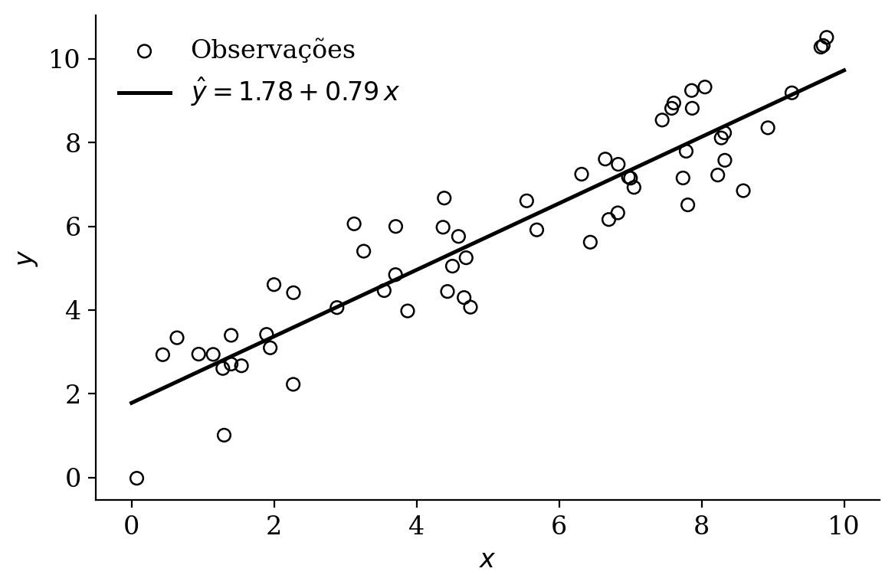

---
# Modelo de dissertação/tese do IESP-UERJ (ABNT) — exemplo em português.
# Edite os campos abaixo e escreva os capítulos no corpo do documento.
# Renderize com:  quarto render main.qmd
format:
  iesp-uerj-pdf: default
lang: pt  # localiza referências cruzadas (Figura, Equação, ...)

# ---- Identificação da instituição ----
university: "Universidade do Estado do Rio de Janeiro"
inst-center: "Centro de Ciências Sociais"
unit: "Instituto de Estudos Sociais e Políticos"

# ---- Autoria ----
author-first: "Nome"
author-last: "Sobrenome"
author-abbrev: "N."    # inicial(is) do primeiro nome, ex.: "F." ou "F. L."

# ---- Título ----
title: "Título da dissertação ou tese"          # capa + cabeçalho do Resumo
title-en: "Title of the dissertation or thesis" # cabeçalho do Abstract

# ---- Grau e programa ----
degree: "Mestre"             # Mestre | Doutor | Bacharel | Licenciado
program: "Ciência Política"  # Ciência Política | Sociologia

# ---- Data e local ----
city: "Rio de Janeiro"
day: "dd"
month: "mês"
year: "aaaa"

# ---- Orientador ----
advisor:
  title: "Prof. Dr."
  first: "Nome"
  last: "Sobrenome"
  institution: "Instituto de Estudos Sociais e Políticos -- UERJ"

# ---- Coorientador (opcional; descomente se houver) ----
# co-advisor:
#   title: "Prof. Dr."
#   first: "Nome"
#   last: "Sobrenome"
#   institution: "Instituição -- UERJ"

# ---- Palavras-chave (sempre 4 slots por idioma; use "" para vazio) ----
kw-pt-1: "Primeira palavra-chave"
kw-pt-2: "Segunda palavra-chave"
kw-pt-3: "Terceira palavra-chave"
kw-pt-4: ""

kw-en-1: "First keyword"
kw-en-2: "Second keyword"
kw-en-3: "Third keyword"
kw-en-4: ""

# ---- Banca examinadora (opcional; máx. 6 membros) ----
banca:
  - name: "Primeiro membro titular da banca"
    institution: "Instituição"
  - name: "Segundo membro titular da banca"
    institution: "Instituição"
  - name: "Terceiro membro titular da banca"
    institution: "Instituição"

# ---- Ocultar páginas pré-textuais (opcional; descomente para desativar) ----
# hide-ficha: true            # ficha catalográfica
# hide-banca: true            # folha de aprovação (banca examinadora)
# hide-dedicatoria: true      # dedicatória
# hide-agradecimentos: true   # agradecimentos

# ---- Elementos pré-textuais ----
dedicatoria: "Texto da dedicatória."

agradecimentos: |
  Texto de agradecimento.

  O presente trabalho foi realizado com apoio da Coordenação de
  Aperfeiçoamento de Pessoal de Nível Superior Brasil (CAPES) ---
  Código de Financiamento 001.

# epigrafe: "Texto da epígrafe. (Autor)"

resumo: |
  Texto do resumo em português. O resumo deve conter entre 150 e 500
  palavras conforme as normas da UERJ.

abstract: |
  Abstract text in English. The abstract should contain between 150
  and 500 words according to UERJ standards.

# ---- Natureza do trabalho na folha de rosto (opcional) ----
# Se omitido, a classe gera o texto padrão automaticamente a partir de
# `degree`, `program` e a instituição.
# thesis-nature: "Dissertação apresentada, como requisito parcial..."

# ---- Lista de abreviaturas (opcional) ----
# abreviaturas:
#   - sigla: "CAPES"
#     extenso: "Coordenação de Aperfeiçoamento de Pessoal de Nível Superior"
#   - sigla: "IESP"
#     extenso: "Instituto de Estudos Sociais e Políticos"

# ---- Lista de símbolos (opcional) ----
# simbolos:
#   - simbolo: "$\\alpha$"
#     significado: "Nível de significância"

# ---- Glossário (opcional) ----
# glossario:
#   - termo: "termo"
#     definicao: "significado do termo"

# ---- Apêndices (opcional) ----
# apendices:
#   - titulo: "Primeiro apêndice"
#     conteudo: "Conteúdo do apêndice."

# ---- Anexos (opcional) ----
# anexos:
#   - titulo: "Primeiro anexo"
#     conteudo: "Conteúdo do anexo."

# ---- Bibliografia (citeproc + CSL ABNT NBR 6023:2018 / 10520:2023) ----
bibliography: bibliografia.bib
---

# Introdução {.unnumbered}

> Ao verme que primeiro roeu as frias carnes do meu cadáver dedico como saudosa
> lembrança estas Memórias Póstumas [@bib:Assis1881].

Em estatística vale a máxima de que "todos os modelos estão errados, mas alguns
são úteis" [@bib:Box1976]. Um modelo é uma simplificação deliberada da realidade,
e a arte da modelagem está em escolher quais aspectos preservar. @bib:GelmanHill2007
mostram como modelos de regressão e modelos hierárquicos articulam essa tensão
entre parcimônia e realismo.

A qualidade das conclusões depende tanto do modelo quanto dos dados. Um exemplo
marcante é a previsão das eleições norte-americanas a partir de uma amostra de
usuários do Xbox — fortemente enviesada em relação ao eleitorado — que, após
ajuste estatístico adequado, produziu estimativas competitivas com pesquisas
tradicionais [@bib:Wang2015].

# Mínimos quadrados ordinários

Considere o modelo de regressão linear em forma matricial,

$$
\mathbf{y} = \mathbf{X}\boldsymbol{\beta} + \boldsymbol{\varepsilon},
$$ {#eq-modelo}

em que $\mathbf{y}$ é o vetor $n \times 1$ de respostas, $\mathbf{X}$ é a matriz
$n \times p$ de covariáveis, $\boldsymbol{\beta}$ é o vetor de coeficientes e
$\boldsymbol{\varepsilon}$ é o vetor de erros.

## Derivação da forma fechada

O estimador de mínimos quadrados ordinários minimiza a soma dos quadrados dos
resíduos:

$$
S(\boldsymbol{\beta})
= \lVert \mathbf{y} - \mathbf{X}\boldsymbol{\beta} \rVert^{2}
= (\mathbf{y} - \mathbf{X}\boldsymbol{\beta})^{\top}
  (\mathbf{y} - \mathbf{X}\boldsymbol{\beta}).
$$

Expandindo o produto e usando que $\boldsymbol{\beta}^{\top}\mathbf{X}^{\top}\mathbf{y}$
é um escalar (logo igual à sua transposta),

$$
\begin{aligned}
S(\boldsymbol{\beta})
  &= \mathbf{y}^{\top}\mathbf{y}
   - 2\,\boldsymbol{\beta}^{\top}\mathbf{X}^{\top}\mathbf{y}
   + \boldsymbol{\beta}^{\top}\mathbf{X}^{\top}\mathbf{X}\boldsymbol{\beta}.
\end{aligned}
$$

A condição de primeira ordem é obtida derivando em relação a $\boldsymbol{\beta}$
e igualando a zero:

$$
\frac{\partial S}{\partial \boldsymbol{\beta}}
= -2\,\mathbf{X}^{\top}\mathbf{y}
  + 2\,\mathbf{X}^{\top}\mathbf{X}\boldsymbol{\beta}
\overset{!}{=} \mathbf{0}.
$$

Supondo que $\mathbf{X}^{\top}\mathbf{X}$ seja invertível, resolve-se para o
estimador na sua célebre forma fechada:

$$
\hat{\boldsymbol{\beta}} = (\mathbf{X}^{\top}\mathbf{X})^{-1}\mathbf{X}^{\top}\mathbf{y}.
$$ {#eq-ols}

## Ilustração

A @fig-regressao apresenta um conjunto de pontos $(x_i, y_i)$ e a reta ajustada
pela @eq-ols. A @tbl-coef resume as estimativas, com os respectivos erros-padrão
e estatísticas $t$.

| Coeficiente            | Estimativa | Erro-padrão | Estatística $t$ |
|:-----------------------|:----------:|:-----------:|:---------------:|
| $\beta_0$ (intercepto) |    1,78    |    0,25     |      7,20       |
| $\beta_1$ (inclinação) |    0,79    |    0,04     |     18,95       |

: Estimativas de mínimos quadrados ordinários. Fonte: elaboração própria (2026). {#tbl-coef}

{#fig-regressao width=75%}

# Conclusão {.unnumbered}

Modelos são úteis quando ajudam a aprender com os dados [@bib:Box1976], e a forma
fechada do MQO em @eq-ols é o ponto de partida para extensões mais ricas, como os
modelos hierárquicos de @bib:GelmanHill2007.

# Referências {.unnumbered}

::: {#refs}
:::
